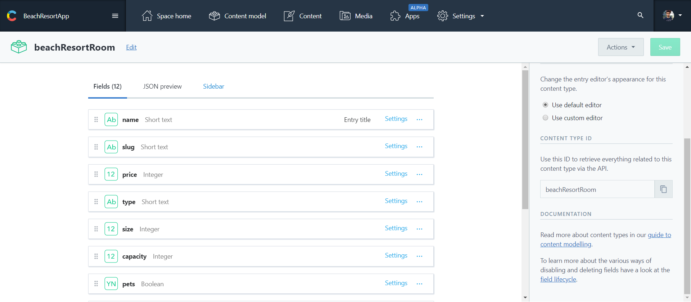
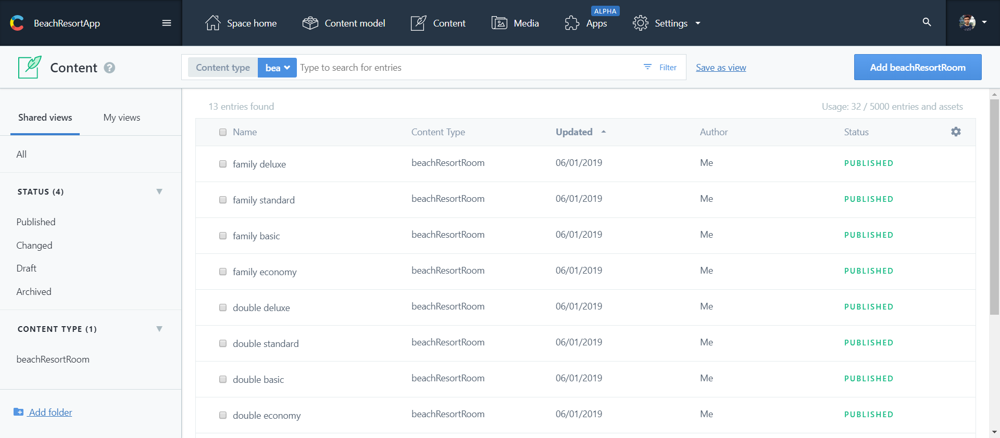
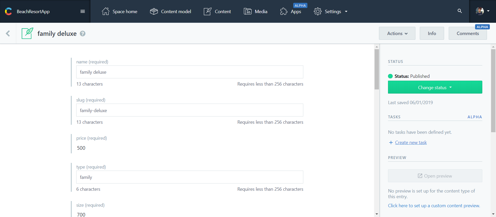
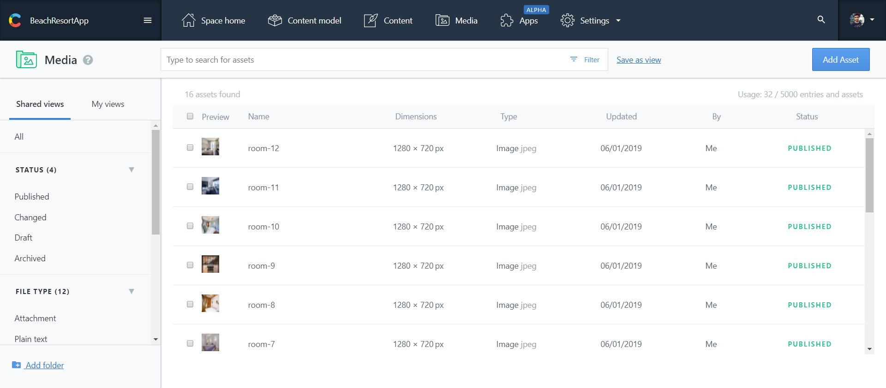
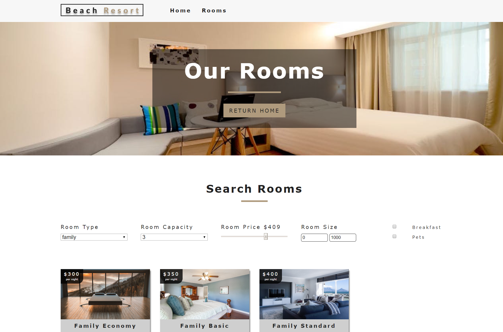
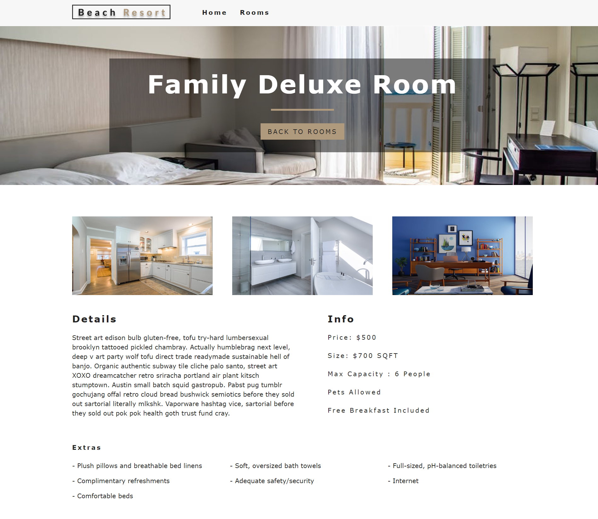

# React Beach Resort 

It is a Resort website where user can checkout different types of rooms such as single, double, family and presidential. There is a filter in room page where user can filter rooms by room type, room capacity, price and whether pet is allowed or not.

Live link: <a href="https://my-react-resort.netlify.com/" target="_blank">Click here</a>


---

## Quick Start

```bash
# clone repository
https://github.com/savajapurva/ResortP.git

# Install dependencies
cd ResortP && npm install

```
To query and get content using the APIs, client applications need to authenticate with both the Space ID and an access token. So, create account in contentful and then create an App. 

API keys of your app will be in setting -> API keys section

Now, create an .env.development file in yor project and add your keys.

```
REACT_APP_API_SPACE=YOUR_SPACE
REACT_APP_API_ACCESS_TOKEN=YOUR_ACCESS_TOKEN
```

To access your data from contentful, you need to add all your fields and data to the content model. Kindly, refer to the below snapshot of my dashboard.

```


```


```


```


```

To run the development server:

```bash
# the development server runs on port 3000
npm run dev
```

To run production build:

```bash
# create code bundle
npm run build

# run production server
npm run prod
```

### To deploy this project to heroku see steps below:

You will need to create an account in Netlify

```bash
# Heroku-cli (paste link in browser)
https://devcenter.heroku.com/articles/heroku-cli
```

Afer installing heroku-cli run the following commands in terminal

```bash
# login locally
heroku login
```

You will be prompted to enter your email and password which is the same the email and password used when you sign up for Heroku

```bash
# create your app
heroku create

# set enviroment vareiables
heroku config:set mongoURI=YOUR_OWN_MONGO_URI
heroku config:set secretOrKey=YOUR_OWN_SECRET
```

Try to keep your production DB different from development DB

```bash
# bundle code for production
npm run build

# deploy code to heroku
git push heroku master:master
```


---



---



---

## Main Technologies

### Client Side

- [x] **[React](https://github.com/facebook/react)**
- [x] **[Redux](https://github.com/reactjs/redux)**
- [x] **[Twitter Bootstap 4](https://github.com/twbs/bootstrap/tree/v4-dev)**
- [x] **[React-Router-DOM](https://github.com/ReactTraining/react-router/tree/master/packages/react-router-dom)**

#### Libraries used in Client-side

- [x] **[axios](https://github.com/axios/axios)**
- [x] **[classnames](https://github.com/JedWatson/classnames)**
- [x] **[react-moment](https://github.com/headzoo/react-moment)**
- [x] **[react-redux](https://github.com/reduxjs/react-redux)**
- [x] **[redux-thunk](https://github.com/reduxjs/redux-thunk)**
- [x] **[validator](https://github.com/chriso/validator.js)**

### Server Side

- [x] **[Node.js / Express](https://github.com/expressjs/express)**
- [x] **[MongoDB](https://github.com/mongodb/mongo)**
- [x] **[JWT](https://github.com/auth0/node-jsonwebtoken)**
- [x] **[Passport](http://www.passportjs.org/)**
- [x] **[Passport-jwt](https://github.com/themikenicholson/passport-jwt)**

#### Libraries used in Server-side

- [x] **[bcryptjs](https://github.com/dcodeIO/bcrypt.js)**
- [x] **[bluebird](http://bluebirdjs.com/docs/getting-started.html)**
- [x] **[gravatar](https://github.com/emerleite/node-gravatar)**
- [x] **[mongoose](http://mongoosejs.com/)**
- [x] **[jwt-decode](https://github.com/auth0/jwt-decode)**
- [x] **[moment](https://momentjs.com/)**
- [x] **[validator](https://github.com/chriso/validator.js)**
